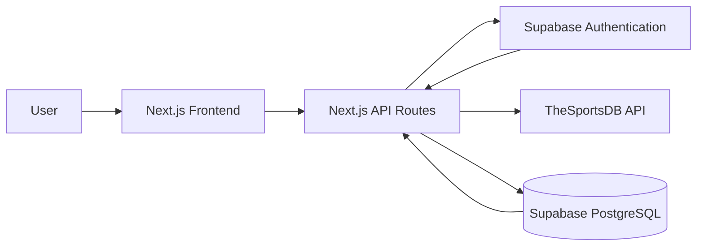
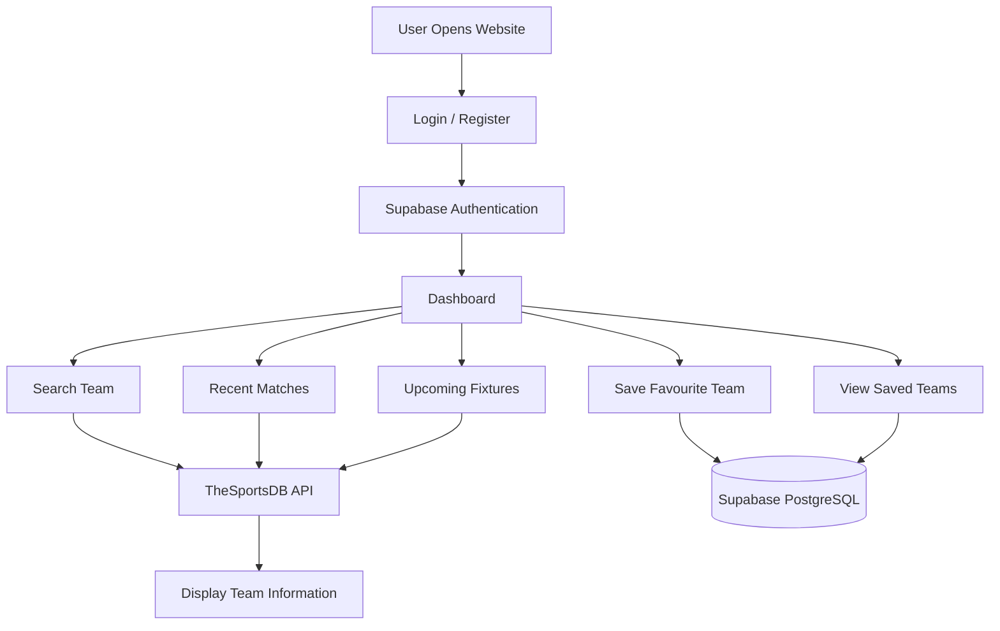
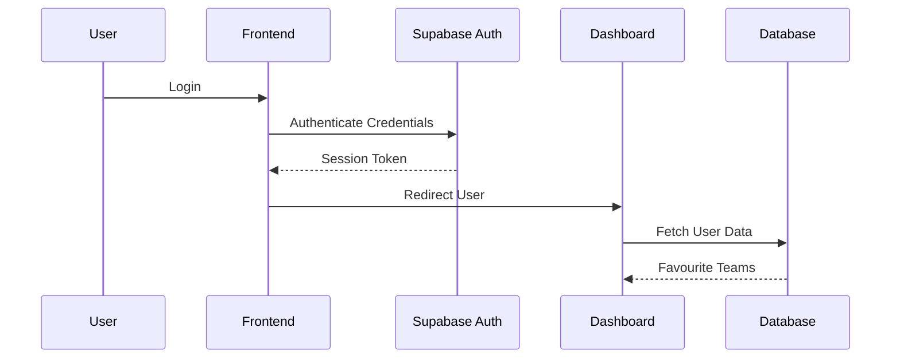
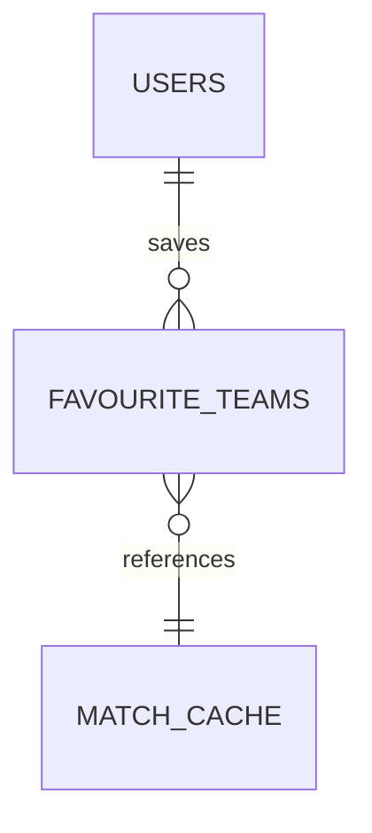
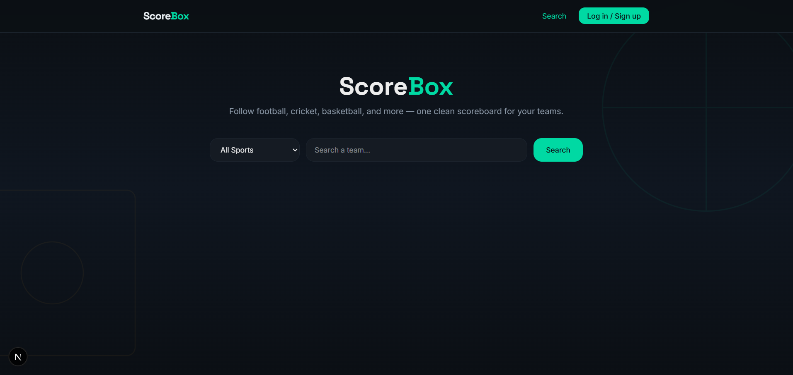
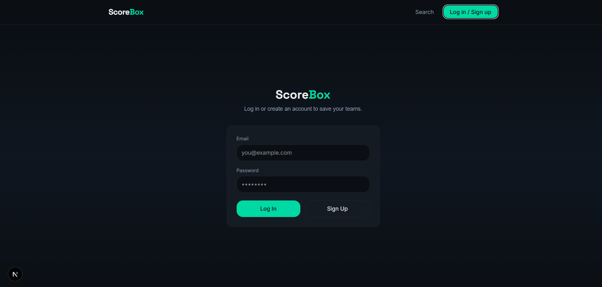
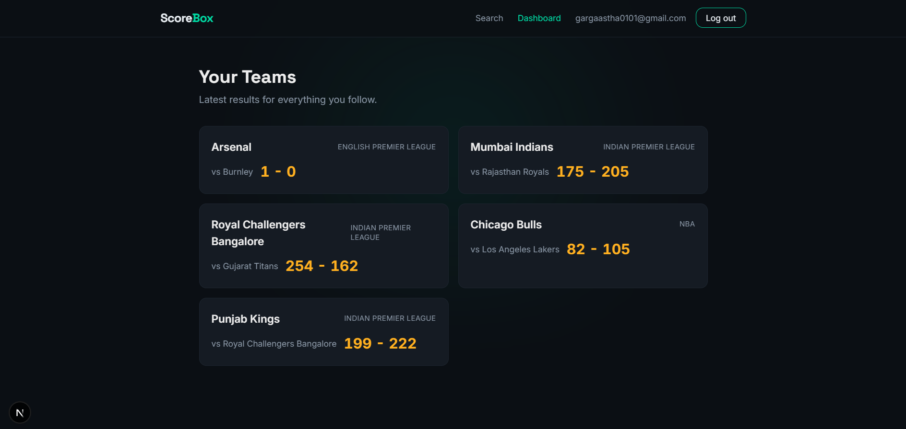

<div align="center">

# ScoreBox

### Your Personal Multi-Sport Team Tracker

Search • Save • Track • Stay Updated

<p align="center">
A full-stack web application that enables sports enthusiasts to discover teams across multiple sports, save their favourites, and monitor recent results, upcoming fixtures, team information, and squad details from one personalized dashboard.
</p>

<p align="center">


</p>

<p align="center">

 **Live Demo:** https://scorebox-brown.vercel.app

</p>

---

</div>

# About The Project

ScoreBox is a **full-stack sports tracking platform** developed to simplify the way users follow their favourite sports teams.

Instead of checking multiple websites for results, fixtures, team information, and squad details, ScoreBox provides a unified dashboard where users can search teams across different sports, save them to their profile, and quickly access important information whenever they log in.

The project was built to demonstrate practical software engineering skills including:

- Full-stack web development
- Authentication & Authorization
- REST API integration
- Database design
- Caching strategy
- Backend API development
- Responsive UI development
- Deployment on Vercel

---


# Key Features

| Feature | Description |
|---------|-------------|
| Authentication | Secure user authentication and session management using Supabase Auth. |
| Team Search | Search sports teams across multiple sports using TheSportsDB API. |
| Dashboard | Access a personalized dashboard with your saved teams. |
| Favourite Teams | Save and manage favourite teams for quick access. |
| Team Details | View team information including stadium, league, country, and description. |
| Match Information | View recent match results and upcoming fixtures. |
| Squad Information | Browse player information for selected teams. |
| API Caching | Cache frequently requested data to reduce external API calls and improve performance. |
| Responsive Design | Optimized for desktop, tablet, and mobile devices. |

---

# Tech Stack

| Category | Technology |
|------------|------------|
| Frontend | Next.js (App Router) |
| Language | TypeScript |
| Styling | Tailwind CSS |
| Backend | Next.js API Routes |
| Database | PostgreSQL (Supabase) |
| Authentication | Supabase Auth |
| External API | TheSportsDB |
| Deployment | Vercel |
| Version Control | Git & GitHub |

---

# Repository Structure

```text
SPORTS-TRACKER
│
├── app
│   ├── api
│   │   ├── search-team
│   │   │   └── route.ts
│   │   ├── team-detail
│   │   │   └── route.ts
│   │   └── team-matches
│   │       └── route.ts
│   │
│   ├── components
│   │   └── Navbar.tsx
│   │
│   ├── dashboard
│   │   └── page.tsx
│   │
│   ├── login
│   │   └── page.tsx
│   │
│   ├── team
│   │   └── [id]
│   │       └── page.tsx
│   │
│   ├── favicon.ico
│   ├── globals.css
│   ├── layout.tsx
│   └── page.tsx
│
├── public
│
├── utils
│   └── supabase
│       ├── client.ts
│       ├── middleware.ts
│       └── server.ts
│
├── .env.local
├── .gitignore
├── eslint.config.mjs
├── middleware.ts
├── next.config.ts
├── package.json
├── package-lock.json
├── postcss.config.mjs
├── tsconfig.json
└── README.md
```

---


# System Architecture

The application follows a modern full-stack architecture built on Next.js, where the frontend, backend APIs, authentication, and database work together to provide a seamless user experience.



### Architecture Components

| Component | Responsibility |
|------------|----------------|
| Next.js Frontend | User interface and client-side interactions |
| API Routes | Handles business logic and communication between frontend, database and external APIs |
| Supabase Authentication | User registration, login and session management |
| PostgreSQL Database | Stores users, favourite teams and cached match data |
| TheSportsDB API | Provides team information, fixtures, players and results |

---

## Application Workflow



---

# Authentication Flow

The application uses Supabase Authentication to securely manage user accounts and sessions.



---

# Database Design

The project stores persistent user information using PostgreSQL through Supabase.

## Main Tables

| Table | Purpose |
|--------|---------|
| users | Stores authenticated user information |
| favourite_teams | Stores teams saved by each user |
| match_cache | Stores recently fetched fixtures and results to reduce repeated API requests |

---

## Database Relationships



---

# Project Highlights

- Full-stack application using Next.js App Router
- TypeScript-based codebase
- Authentication with Supabase
- PostgreSQL database integration
- REST API consumption
- Server-side rendering
- Responsive user interface
- Cached API responses for improved performance
- Cloud deployment using Vercel

---

# Installation

Follow these steps to run the project locally.

## Prerequisites

Make sure the following software is installed:

| Software | Version |
|----------|---------|
| Node.js | 18+ |
| npm | Latest |
| Git | Latest |

---

## Clone the Repository

```bash
git clone https://github.com/aasthagarg-01/ScoreBox.git
```

```bash
cd ScoreBox
```

---

## Install Dependencies

```bash
npm install
```

## Run the Development Server

```bash
npm run dev
```

Open the application in your browser:

```text
http://localhost:3000
```

# Deployment

The project is deployed using **Vercel**.

Deployment workflow:

1. Push the project to GitHub.
2. Import the repository into Vercel.
3. Configure environment variables.
4. Deploy.

Every push to the main branch automatically triggers a new deployment.

---

# Application Preview


## Home Page



---

## Login Page



---

## Dashboard



---


# Challenges Faced

Some of the key challenges encountered during development included:

- Integrating external sports APIs with inconsistent response structures.
- Managing authenticated and unauthenticated user flows.
- Designing a database structure for favourite teams.
- Preventing unnecessary API requests through caching.
- Maintaining responsive layouts across multiple devices.

These challenges helped strengthen understanding of full-stack application development and backend integration.

---

# Future Improvements

Possible enhancements include:

- Live match scores.
- League standings.
- Push notifications.
- Team comparison.
- Search history.

---


# Author

**Aastha Garg**

GitHub: https://github.com/aasthagarg-01

---

### If you discover an issue or have an idea for improvement, feel free to open an issue or submit a pull request.
